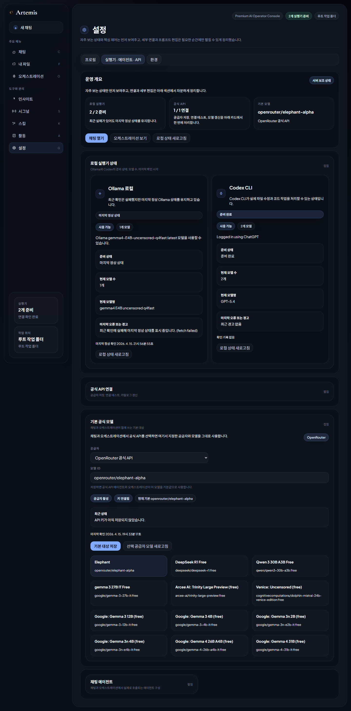
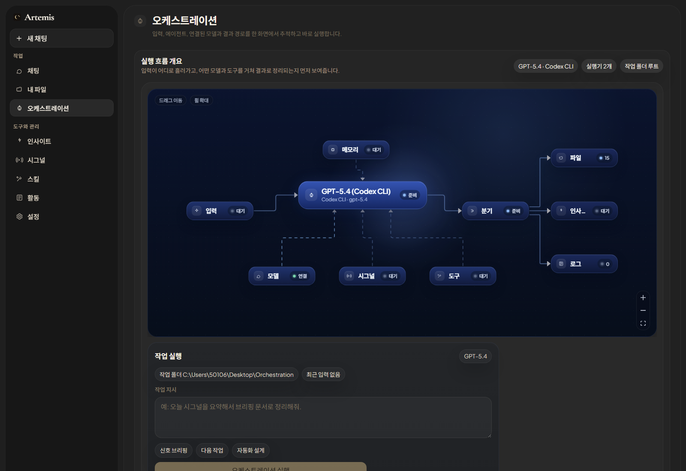
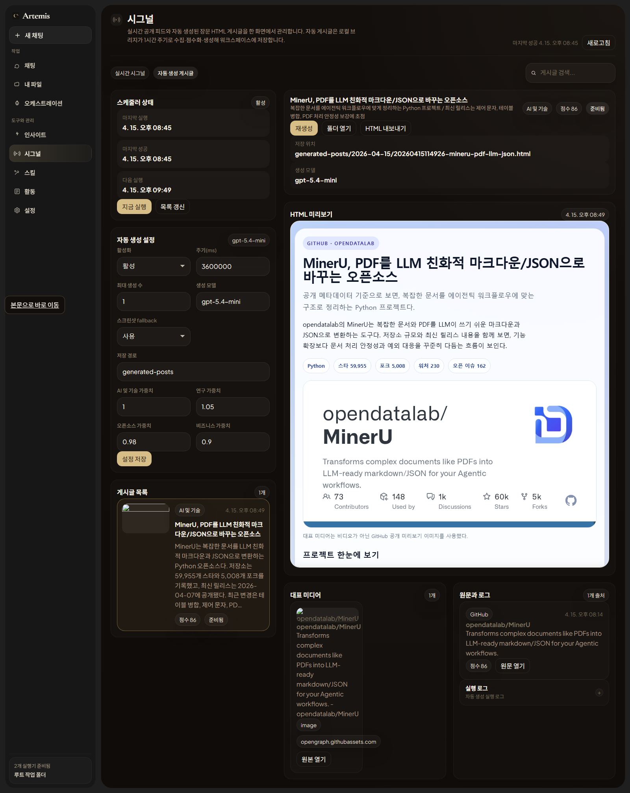

# Artemis Orchestration

아르테미스는 `채팅`, `파일 작업`, `오케스트레이션`, `실행 로그`를 한 화면 흐름으로 묶는 로컬 작업 워크스페이스입니다.

이번 버전에서는 기존 UI 안에 `공식 API 기반 무료 라우팅`을 붙였습니다.  
지원 공급자는 아래 3개만 실제 동작합니다.

- OpenRouter
- NVIDIA Build
- Gemini Developer API

## Hermes-style Codex 운영 구조

이 저장소는 Hermes가 기본 내장된 환경이 아니며, 대신 Codex 안에서 바로 쓸 수 있는 로컬 운영 구조를 함께 둡니다.

- 진입 문서: [HERMES_CODEX.md](HERMES_CODEX.md)
- 세션 진입 파일: [AGENTS.md](AGENTS.md)
- 역할 정의: [`codex/roles/`](codex/roles)
- 재사용 스킬: [`codex/skills/`](codex/skills)
- 워크플로우 계약: [`codex/workflow/contract.md`](codex/workflow/contract.md)
- 외부 메모: [`memory/`](memory)

## 주요 화면

### 채팅


### 설정



### 오케스트레이션



### 시그널 자동 게시글



## 이 기능이 하는 일

설정 화면에서 공급자별 API 키를 저장하면, 아르테미스가 아래 순서로 동작합니다.

1. 공급자별 무료 후보 모델 목록을 불러옵니다.
2. 현재 API 키로 실제 호출 가능한지 검증합니다.
3. 선택한 라우팅 모드에 따라 점수를 계산합니다.
4. 가장 점수가 높은 무료 후보부터 시도합니다.
5. 실패하면 다음 무료 후보로 자동 폴백합니다.
6. 채팅 화면에서 스트리밍 응답, 시도 로그, 폴백 이유를 함께 보여줍니다.

## 시그널 자동 게시글 생성기

이번 버전에는 기존 시그널 피드를 확장한 `자동 게시글 생성기`가 들어 있습니다.

브리지는 아래 순서로 동작합니다.

1. 기존 시그널 쿼리 구조로 Hacker News, GitHub, arXiv 공개 피드를 수집합니다.
2. URL 정규화와 소스별 메타데이터 확장으로 후보를 정리합니다.
3. 최신성, 출처 품질, AI 관련성, 커뮤니티 반응, 카테고리 가중치로 점수를 계산합니다.
4. 상위 1~3개 후보만 골라 대표 미디어를 확보합니다.
5. Codex로 한국어 장문 HTML 기사형 게시글을 생성합니다.
6. 생성 실패 시에도 규칙 기반 fallback HTML을 저장합니다.
7. 결과물과 상태는 아래 경로에 저장됩니다.

- `generated-posts/YYYY-MM-DD/*.html`
- `generated-posts/YYYY-MM-DD/*.json`
- `generated-posts/index.json`
- `generated-posts/state.json`
- `media-cache/*`

프런트의 `시그널 -> 자동 생성 게시글` 탭에서는 아래를 바로 할 수 있습니다.

- 생성된 게시글 목록 보기
- 실제 HTML 미리보기
- 원문 링크와 첨부 미디어 확인
- `지금 실행`
- `재생성`
- `폴더 열기`
- `HTML 내보내기`
- 스케줄러 상태 및 설정 관리

## 왜 3개 공급자만 지원하나

이번 구현의 목표는 `실제로 동작하는 공식 API 라우팅`을 만드는 것입니다.  
공식 문서와 안정적인 스트리밍 호출 구조가 비교적 명확한 3개만 먼저 붙였습니다.

- OpenRouter
- NVIDIA Build
- Gemini Developer API

Ollama, 일반 OpenAI 호환 임의 엔드포인트, Groq, Cloudflare, Cohere, Mistral 등은 이번 버전에서 실제 라우팅 대상으로 넣지 않았습니다.

## 무료 후보 자동 선택 방식

기본 라우팅 모드는 `자동 무료 최상`입니다.

지원 모드:

- `auto-best-free`
- `auto-best-free-coding`
- `auto-best-free-fast`
- `manual`

기본 점수 계산식:

```txt
final_score =
  quality_score * 0.40 +
  reasoning_score * 0.22 +
  coding_score * 0.22 +
  stability_score * 0.10 +
  speed_score * 0.06 +
  availability_bonus -
  failure_penalty
```

가중치는 [`config/free_model_registry.json`](config/free_model_registry.json) 에서 조정할 수 있습니다.

## 무료 후보 검증 방식

무료 후보는 두 기준을 함께 봅니다.

- 문서상 또는 설정상 무료 후보인지
- 현재 저장된 API 키로 실제 호출이 성공하는지

즉 `무료 모델`이라는 말은 `모델 사용료 후보` 기준이고, `API 키 없이 바로 된다`는 뜻은 아닙니다.  
OpenRouter 무료 후보도 OpenRouter 공식 API 키가 필요하고, Gemini 무료 후보도 Gemini Developer API 키가 필요합니다.

## 폴백 방식

폴백은 공급자 고정 순서가 아닙니다.

- 현재 활성화된 공급자
- 무료 후보
- 제외되지 않음
- 실제 사용 가능으로 검증됨
- 현재 라우팅 모드 점수

이 조건으로 정렬된 `점수 순서`대로 시도합니다.

자동 폴백 대상 실패 조건:

- 429
- 402 / 403 과금 또는 권한 실패
- 5xx
- 네트워크 오류
- 첫 토큰 타임아웃
- 스트리밍 시작 실패
- 응답 포맷 오류
- 연결 테스트 실패

시도 로그에는 아래 항목이 남습니다.

- attempt_index
- provider
- model
- started_at
- first_token_at
- ended_at
- success
- error_type
- error_message
- status_code
- latency_ms
- fallback_reason
- score_at_selection

## 보안 처리 방식

- API 키는 브리지 서버에서만 복호화합니다.
- 프런트엔드에는 마스킹된 값만 전달합니다.
- 실제 값은 SQLite 저장소에 암호화해서 넣습니다.
- 로그와 UI에 키 원문을 출력하지 않습니다.

저장소 위치:

- DB: `output/ai-router/artemis.db`

## 실행 방법

### 1. 설치

```bash
npm install
```

### 2. 환경 변수 파일 준비

```bash
cp .env.example .env
```

### 3. 브리지 실행

```bash
npm run bridge
```

### 4. 프런트 실행

```bash
npm run dev
```

### 5. 빌드 확인

```bash
npm run build
```

### 6. 자동 게시글 수동 실행 확인

PowerShell 예시:

```powershell
$body = @{
  category = 'AI 및 기술'
  limit    = 1
  force    = $true
} | ConvertTo-Json

Invoke-RestMethod `
  -Uri 'http://127.0.0.1:4174/api/auto-posts/run' `
  -Method Post `
  -ContentType 'application/json; charset=utf-8' `
  -Body $body
```

## WSL 기준 실행

아래 순서대로 그대로 실행하면 됩니다.

```bash
cp .env.example .env
npm install
npm run bridge
```

프런트 개발 서버까지 같이 띄우려면:

```bash
npm run dev -- --host 127.0.0.1 --port 4173
```

기본 브리지 주소는 `http://127.0.0.1:4174` 입니다.

## 환경 변수 설명

필수에 가까운 값:

- `APP_ENCRYPTION_KEY`
- `DEFAULT_ROUTING_MODE`
- `FIRST_TOKEN_TIMEOUT_MS`
- `REQUEST_TIMEOUT_MS`

공급자별 키:

- `OPENROUTER_API_KEY`
- `NVIDIA_BUILD_API_KEY`
- `GEMINI_API_KEY`

선택 후보 오버라이드:

- `OPENROUTER_DEFAULT_CANDIDATES`
- `NVIDIA_BUILD_DEFAULT_CANDIDATES`
- `GEMINI_DEFAULT_CANDIDATES`

OpenRouter 부가 정보:

- `OPENROUTER_APP_TITLE`
- `OPENROUTER_HTTP_REFERER`

데이터 저장 경로:

- `ARTEMIS_DATA_DIR`
- `ARTEMIS_AUTO_POST_OUTPUT_DIR`

자동 게시글 생성기:

- `ARTEMIS_AUTO_POST_ENABLED`
- `ARTEMIS_AUTO_POST_INTERVAL_MS`
- `ARTEMIS_AUTO_POST_TOP_K`
- `ARTEMIS_AUTO_POST_MODEL`
- `ARTEMIS_AUTO_POST_SCREENSHOT_FALLBACK`
- `ARTEMIS_AUTO_POST_OUTPUT_DIR`

자세한 예시는 [`.env.example`](.env.example) 를 보면 됩니다.

## 테스트

```bash
npm run lint
npm run build
node --test local-bridge/ai/router.test.mjs
```

## 현재 제한 사항

- 실제 무료 호출 가능 여부는 공급자 정책 변경에 따라 바뀔 수 있습니다.
- 공급자별 모델 이름은 이후 바뀔 수 있으므로, 기본 후보는 설정 파일과 실제 검증 결과를 함께 사용합니다.
- 이번 버전은 전역 기본 라우팅 정책까지만 실제 동작합니다.
- 에이전트별 override 구조는 나중에 확장할 수 있게만 열어뒀습니다.
- 소비자용 웹사이트 로그인 자동화, 쿠키 주입, 무료 한도 우회 같은 기능은 구현하지 않았습니다.

## 관련 파일

- 무료 후보 레지스트리: [`config/free_model_registry.json`](config/free_model_registry.json)
- 공급자 어댑터: [`local-bridge/ai/providers.mjs`](local-bridge/ai/providers.mjs)
- 라우터: [`local-bridge/ai/router.mjs`](local-bridge/ai/router.mjs)
- 저장 계층: [`local-bridge/ai/storage.mjs`](local-bridge/ai/storage.mjs)
- 프런트 클라이언트: [`src/lib/aiRoutingClient.ts`](src/lib/aiRoutingClient.ts)
- 설정 UI: [`src/pages/SettingsPage.tsx`](src/pages/SettingsPage.tsx)
