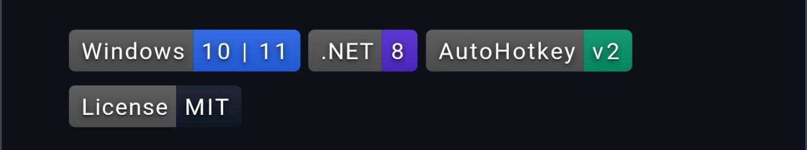

<!-- ARTEMIS-IGNIS-TOP:START -->

  

<!-- ARTEMIS-IGNIS-TOP:END -->

# Artemis Orchestration App

<!-- ARTEMIS-IGNIS-BADGE-BAR:START -->

  
  
  
  

<!-- ARTEMIS-IGNIS-BADGE-BAR:END -->

[한국어 README](README.ko.md)

Artemis Orchestration App is a local-first AI workspace that connects chat, file context, orchestration flow, execution logs, and model/runtime status into one operator-friendly surface.

## Highlights

- Chat-first workspace for giving natural-language work instructions.
- File context view for grounding tasks in the local project folder.
- Orchestration view that visualizes work as an execution flow instead of a static mockup.
- Runtime and model status surfaces for local models and provider-backed agents.
- Execution logs and activity traces for reviewing what happened after a run.

## Local Development

`powershell
pnpm install
pnpm dev
`

Open the local app from the URL printed by Next.js.

## Repository Notes

- The default README is English.
- Korean documentation is maintained in [README.ko.md](README.ko.md).
- Visual identity assets live under docs/assets/.

<!-- ARTEMIS-IGNIS-BADGES:START -->

  

<!-- ARTEMIS-IGNIS-BADGES:END -->
