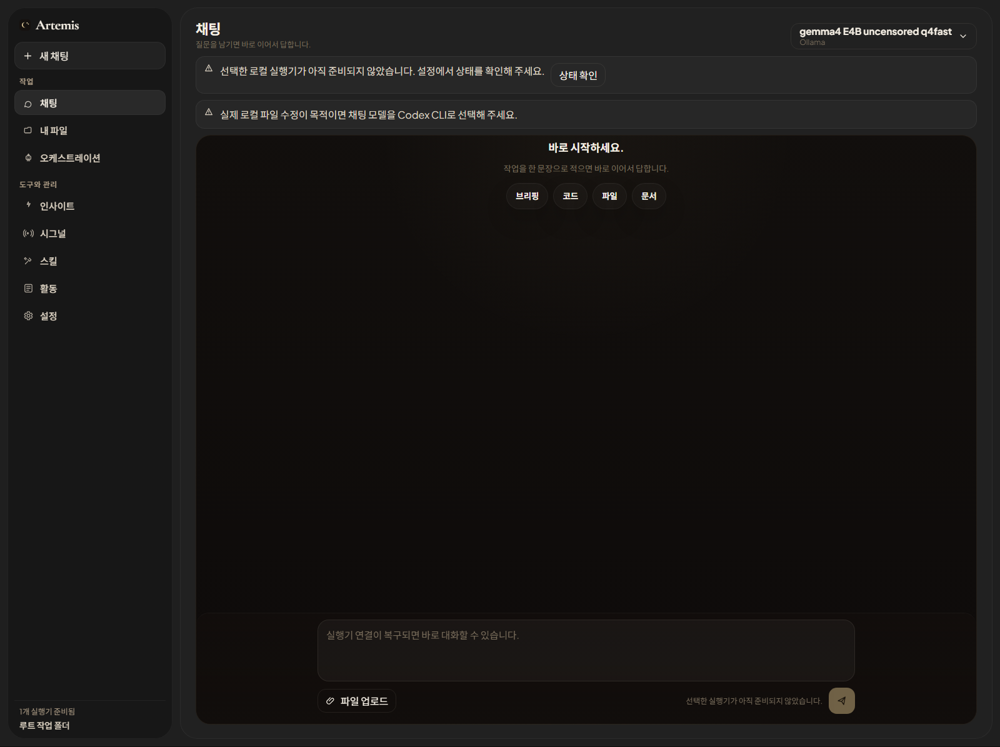
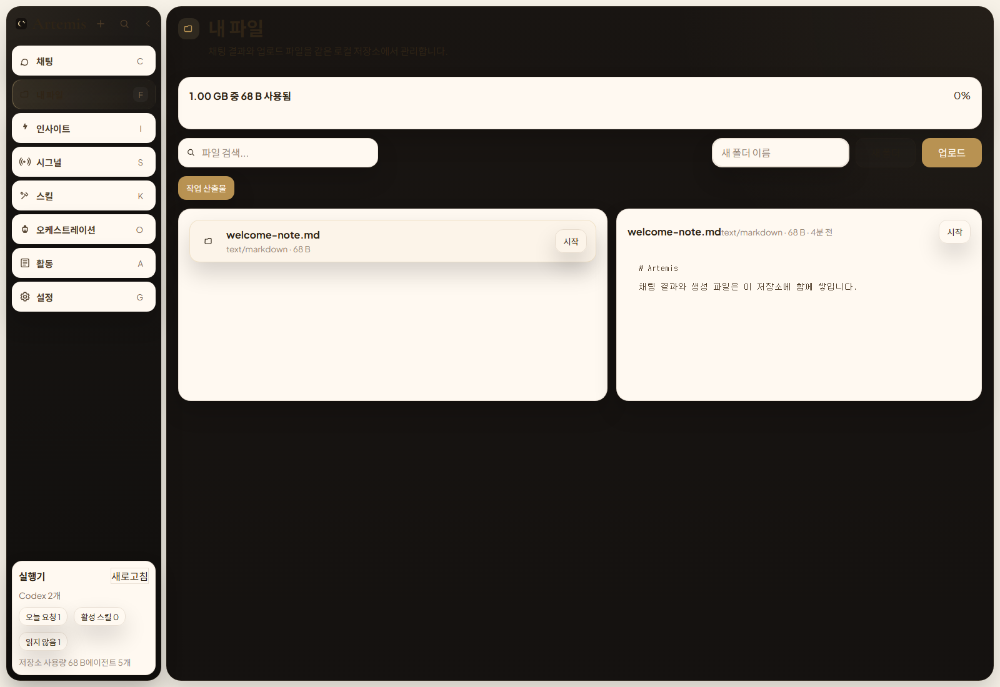
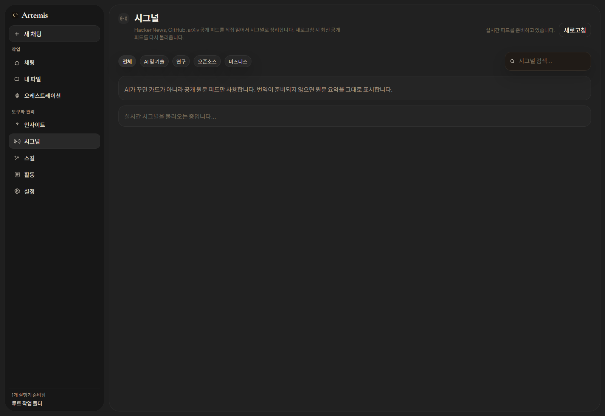

# Artemis Orchestration App

로컬 실행기와 여러 모델 연결을 한 화면에서 다루기 위해 만드는 AI 오케스트레이션 웹 앱입니다.

채팅, 로컬 파일 작업, 시그널 수집, 스킬 관리, 오케스트레이션 흐름을 한 앱 안에서 연결하는 것을 목표로 개발하고 있습니다.

## 프로젝트 소개

이 프로젝트는 아래 문제를 해결하기 위해 만들고 있습니다.

- 여러 AI 모델과 실행기를 하나의 UI에서 선택하고 실행하기
- 로컬 작업 폴더와 연결해 파일을 읽고, 업로드하고, 수정 흐름을 만들기
- 공개 피드를 수집해 시그널 형태로 정리하기
- 모델, 도구, 상태, 실행 로그를 오케스트레이션 화면에서 확인하기

아직 개발 중인 프로젝트이며, 보여주기식 화면이 아니라 실제 로컬 실행과 연결되는 구조를 목표로 계속 개선하고 있습니다.

## 현재 구현된 기능

- 채팅
  - Codex CLI, Ollama 기반 로컬 실행
  - 모델 선택 UI
  - 실행 결과를 채팅 흐름에 반영
- 내 파일
  - 로컬 워크스페이스 경로 연결 구조
  - 파일 목록 조회
  - 파일 업로드
  - 폴더 생성
  - 텍스트 파일 미리보기 및 저장
- 시그널
  - 공개 피드 수집 구조
  - 카테고리별 필터
  - 워치리스트 저장 흐름
- 스킬
  - 스킬 목록 및 활성화 UI
- 오케스트레이션
  - 모델, 도구, 메모리, 출력 흐름을 노드 기반으로 시각화하는 화면 구성
- 설정
  - 에이전트/연결/API 키/환경설정 분리

## 미리보기

### 채팅



### 내 파일



### 시그널



## 실행 주소 안내

- 로컬에서 실행하면 콘솔에 접속 주소가 표시됩니다.
- 프런트는 보통 `http://127.0.0.1:xxxx` 형태의 로컬 주소로 열립니다.
- 브리지는 보통 `http://127.0.0.1:yyyy` 형태의 로컬 주소로 실행됩니다.

## 실행 방법

### 1. 요구 사항

- Node.js 20 이상
- npm
- 선택 사항
  - Ollama
  - Codex CLI

### 2. 패키지 설치

```bash
npm install
```

### 3. 로컬 브리지 실행

```bash
npm run bridge
```

실행 후 콘솔에 표시된 로컬 브리지 주소를 사용합니다.

### 4. 프런트 실행

개발 서버:

```bash
npm run dev
```

빌드 후 미리보기:

```bash
npm run build
npm run preview
```

실행 후 콘솔에 표시된 프런트 주소로 접속합니다.

## 사용 기술

- React 19
- TypeScript
- Vite
- Node.js
- PowerShell
- Codex CLI
- Ollama
- `@xyflow/react`

## 검증 명령

```bash
npm run lint
npm run build
```

## 앞으로 개선할 점

- 내 파일을 실제 로컬 파일시스템 연동 중심으로 더 명확하게 고도화
- 채팅에서 파일 수정 결과와 변경 파일 목록을 더 분명하게 표시
- 오케스트레이션 화면에서 실제 실행 로그와 상태 추적 강화
- 시그널 품질과 한국어 요약 정확도 개선
- 외부 모델 연결 검증 흐름 정리

## 참고

- 이 저장소는 개발 중인 프로젝트입니다.
- 민감 정보, 로컬 로그, 테스트 산출물, 임시 검증 파일은 저장소에 포함하지 않도록 분리했습니다.
